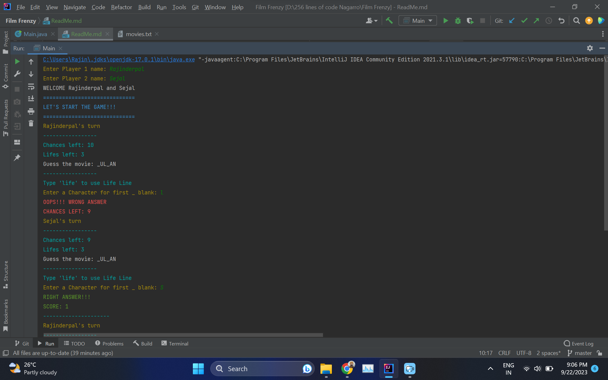
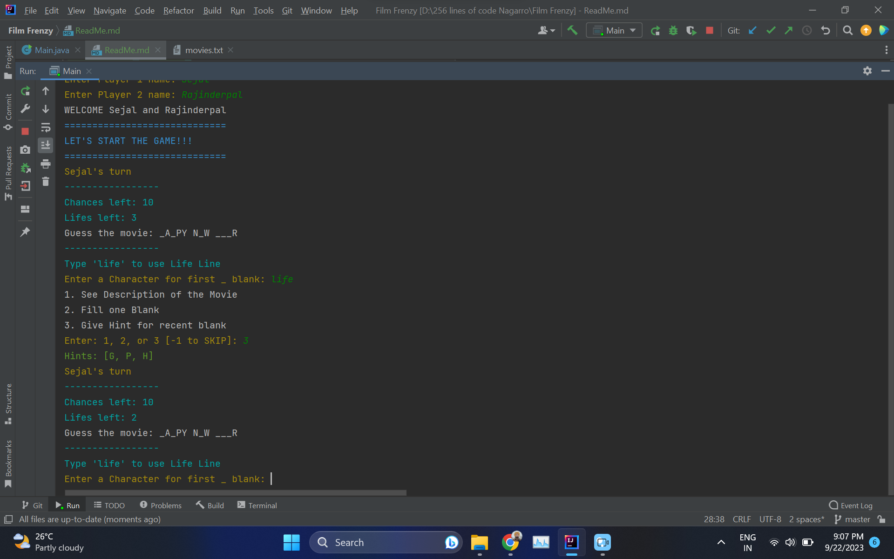
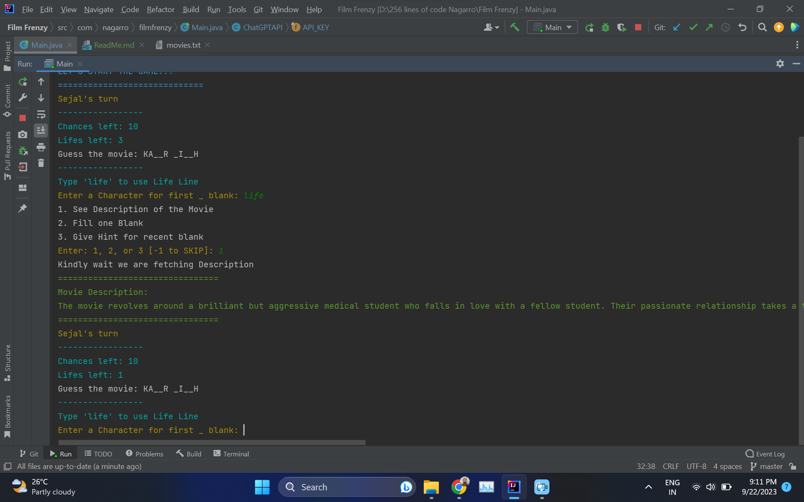

# Film Frenzy Game

Welcome to Film Frenzy, a dynamically working, terminal-based interactive Movie Guessing game! In this game, you'll have the chance to test your movie knowledge by guessing the movie name while solving blanks in the title.

## Features

- **Movie Database:** We've stored a range of movies in an external `movies.txt` file for endless fun.
- **Random Movie Selection:** The game randomly chooses a movie and allocates blanks to the movie name for you to guess.
- **Score Tracking:** Keep track of Scores of players
- **Interactive Terminal:** Our colorful terminal adds a fun and engaging element to the game.
- **Lifelines:** We offer various lifelines to make the game exciting and help you out when you're stuck.
    - **Hint Lifeline:** Use ChatGpt API to get a hint about the movie without revealing its name.
    - **Fill Blank Lifeline:** Spend a life to fill in one blank of the movie name.
    - **Character Hint Lifeline:** Get three random characters as a hint for the recent blank.

## How to Play

1. Run the `Main.java` file on your system to start the game.
2. Follow the interactive prompts to guess the movie name by filling in the blanks.
3. Use lifelines wisely to help you when you're stuck.
4. Keep track of Scores.

## Installation

To play the Film Frenzy Game, make sure you have Java installed on your system. Clone this repository, compile and run the `Main.java` file, and you're ready to enjoy the game.

## Movie Data File

Our game uses an external `.txt` file to store movies. Each movie should be on a separate line in the file. The game will randomly select movies from this file for you to guess.

## Sample Gameplay
- Basic Gameplay

- Using Lifeline

- Used ChatGPT API for Movie Hint

## Team Members

The Film Frenzy Game was developed by:
- Rajinderpal Singh
- Sejal Sharma

We hope you enjoy playing the game and testing your movie knowledge. Have fun!
